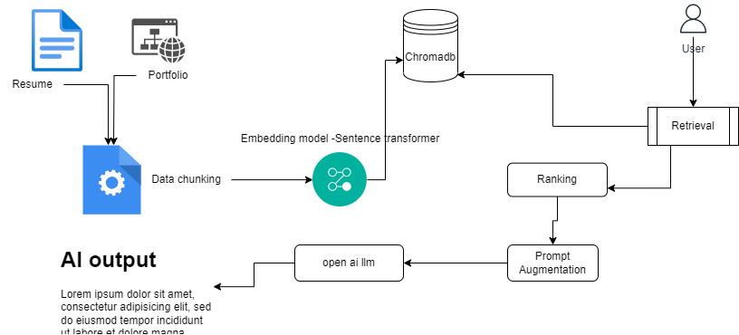
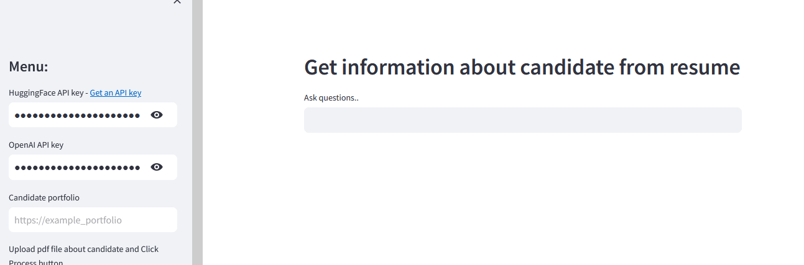
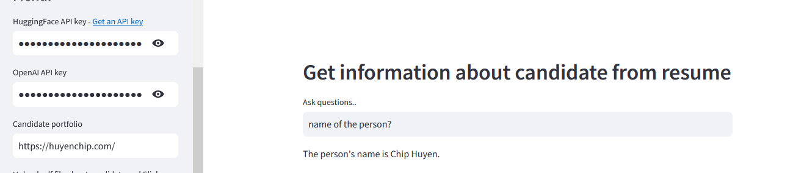

# Chat with PDF/WebContent using LLM

# Project description
The task is to build an chat app that does the following:

* Implement functionality to ingest personal data from various sources such as
text files or PDFs. Examples of personal data include the applicant's resume,
personal website content,
* Utilize a Retrieval-Augmented Generation (RAG) approach for generating
answers.


## Prerequisite
 1. Python
 2. OpenAI API Key
 3. HuggingFace API Key

## Installation
```commandline
pip install requirements.txt
```

## System Design




## Usage
To start the server
```commandline
cd src
python app.py
```
Run 
```
streamlit run app.py --server.port 6006
```

## To use in Docker
```
docker build -t streamlit-app .
docker run -p 6006:6006 streamlit-app
```

## Demo

[Demo Link](https://huggingface.co/spaces/viml/chat_assist)

## Screenshot



