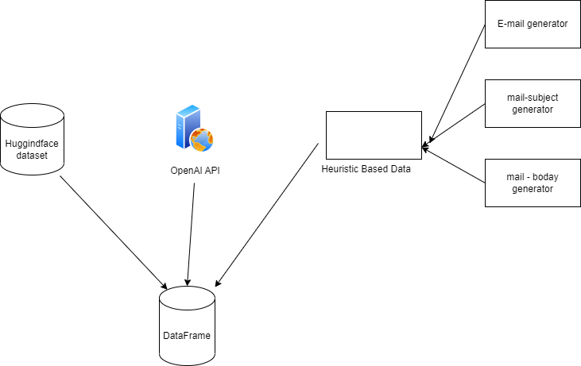
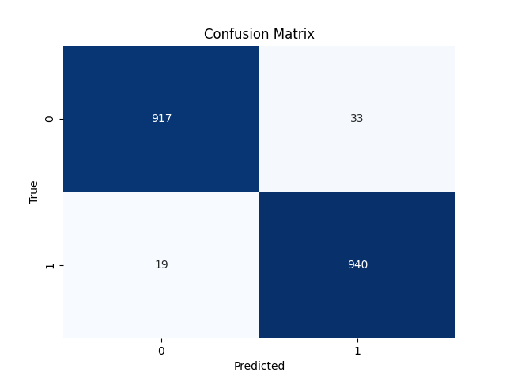
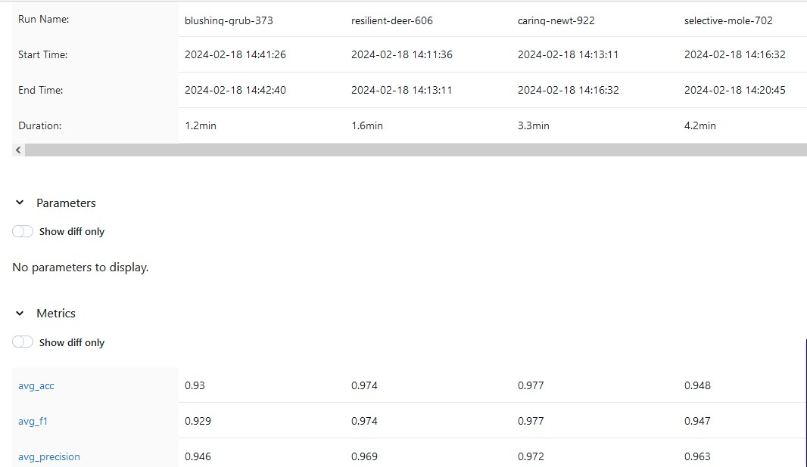
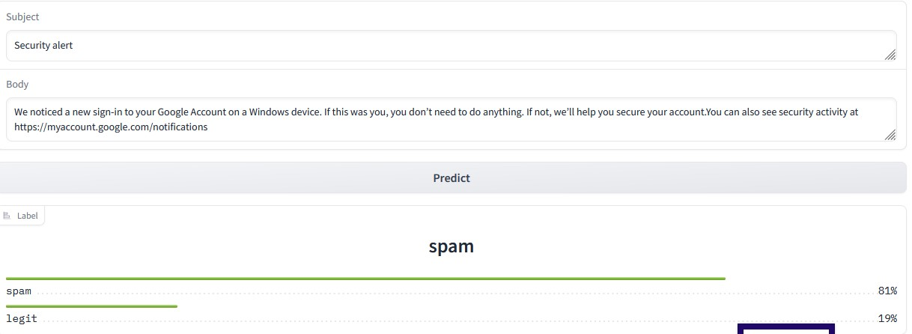

Email Classifier
==============================

Design and implement a simple email phishing classifier. You
will start by creating a synthetic email dataset, followed by building a model to classify emails
as phishing or legitimate. Finally, you will create a demonstration of your classifier using
Hugging Face or Gradio.

Project Organization
------------

    ├── LICENSE
    ├── README.md          <- The top-level README for developers using this project.
    ├── data
    │   ├── processed      <- The final, canonical data sets for modeling.
    │   └── raw            <- The original, immutable data dump.
    │
    │
    ├── models             <- Trained and serialized models, model predictions, or model summaries
    │
    ├── notebooks          <- Jupyter notebooks. Naming convention is a number (for ordering),
    │                         the creator's initials, and a short `-` delimited description, e.g.
    │                         `1.0-jqp-initial-data-exploration`.
    │
    ├── references         <- Data dictionaries, manuals, and all other explanatory materials.
    │
    ├── reports            <- Generated analysis as HTML, PDF, LaTeX, etc.
    │   └── figures        <- Generated graphics and figures to be used in reporting
    │
    ├── requirements.txt   <- The requirements file for reproducing the analysis environment, e.g.
    │                         generated with `pip freeze > requirements.txt`
    │
    ├── setup.py           <- makes project pip installable (pip install -e .) so src can be imported
    ├── src                <- Source code for use in this project.
    │   ├── __init__.py    <- Makes src a Python module
    │   │
    │   ├── data           <- Scripts to download or generate data
    │   │   └── make_dataset.py
    │   │
    │   ├── models         <- Scripts to train models and then use trained models to make
    │   │   │                 predictions
    │   │   ├── predict_model.py
    │   │   └── train_model.py
    │   │
    └── tox.ini            <- tox file with settings for running tox; see tox.readthedocs.io


--------

## Synthetic Data creation
For the data creation, data is created synthetically using heuristics, fake data creation library, LLMs and few realistic data from huggingface spam dataset.

```commandline
cd notebooks
jupyter notebook
```
The above command will open jupyter notebook. Select the Synthetic_Data_Creation.ipynb notebook and execute the cells to create synthetic dataset.

## Data information

```commandline
Phishing class - ~5000 samples
Legit class - ~5000 samples
```

## Sample Data

| sender                                | label | subject                              | message                                                                                                                                                                                                                                                                                                                                         |
|---------------------------------------|-------|--------------------------------------|-------------------------------------------------------------------------------------------------------------------------------------------------------------------------------------------------------------------------------------------------------------------------------------------------------------------------------------------------|
| sales@ecommerce.com                   | ham   | Special Offer: Limited Time Discount | Dear [Customer], We have a special offer just for you! For a limited time, enjoy a 20% discount on selected products.|
| hélpdesk@naukri-customer-support.org  | spam | Important helpdesk notice: Verify your account| We recently received an enquiry related to your account. Please click the link below to review and respond to this enquiry|


## Exploratory Data Analysis

As the data generated is synthetic - Most of the data do not have any missing values. Few data points which were sampled from realworld dataset, they had few NaN columns in message subject and body which were removed.
Other EDA is present in the _notebooks/Synthetic_Data_Creation.ipynb_

**_EDA & Synthetic data generation notebook pdf path - reports/Synthetic_data_creation_eda.pdf_**



## How to train?
1. Install the requirements
    ```commandline
   pip install -r requirements.txt
   ```
2. Train the model
    ```
   cd src/models
   python train_model.py --data_file ../../data/preprocessed_email_data.csv
   ```
3. Start the Mlflow ui in a new terminal tab
    ```
   mlflow ui
   ```

## Sample reports and metrics
   

   

## Serving and result analysis
   
