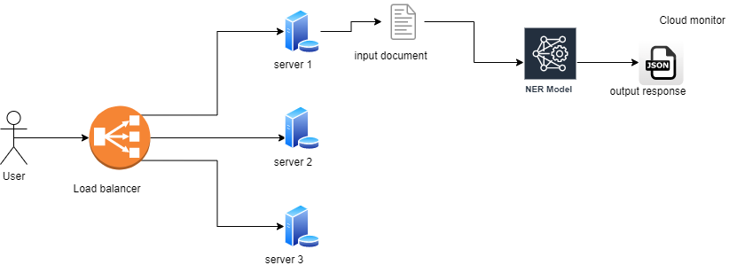

NER System
==============================

Design and implement a simple NER system on given dataset.

Project Organization
------------

    ├── LICENSE
    ├── README.md          <- The top-level README for developers using this project.
    ├── data
    │   ├── ner_dataset.csv      <- The final, canonical data sets for modeling.
    │   
    │
    │
    ├── models             <- Trained models, model predictions, or model summaries
    │
    ├── notebooks          <- Jupyter notebooks. Use EDA_exp_1.ipynb for EDA and baseline model
    │
    ├── references         <- Data dictionaries, manuals, and all other explanatory materials.
    │
    ├── reports            <- Generated analysis as HTML, PDF, LaTeX, etc.
    │   └── figures        <- Generated graphics and figures to be used in reporting
    │
    ├── requirements.txt   <- The requirements file for reproducing the analysis environment, e.g.
    │                         generated with `pip freeze > requirements.txt`
    │
    ├── setup.py           <- makes project pip installable (pip install -e .) so src can be imported
    ├── src                <- Source code for use in this project.
    │   ├── app.py         <- Run the flask server
    │   │
    │   │
    │   │
    └── tox.ini            <- tox file with settings for running tox; see tox.readthedocs.io


--------

## Data analysis
For the data processing, and analysis.

```commandline
cd notebooks
jupyter notebook
```
The above command will open jupyter notebook. Select the EDA_exp_1.ipynb notebook and execute the cells to view the data analysis plots.

## Data information

```commandline
{'O':0, 'B-eve': 1, 'B-geo': 2, 'B-gpe': 3, 'B-nat': 4, 'B-org': 5, 'B-per': 6, 'B-tim': 7, 'I-art': 8, 'I-eve': 9, 'I-geo': 10, 'I-gpe': 11, 'I-nat': 12, 'I-org': 13, 'I-per': 14, 'I-tim': 15, 'B-art': 16}
```

## How to train?
1. Install the requirements
    ```commandline
   pip install -r requirements.txt
   ```
2. Train the model
    ```
   cd notebooks/
   jupyter notebook
   # Execute the cell which contains
   python -m spacy train /content/drive/MyDrive/sapient/config.cfg --output /content/drive/MyDrive/sapient/ --paths.train /content/drive/MyDrive/sapient/train.spacy --paths.dev /content/drive/MyDrive/sapient/val.spacy
   ```
3. Inference
   ```
   !python -m spacy evaluate /content/drive/MyDrive/sapient/split/model-best/ /content/drive/MyDrive/sapient/test_split.spacy --gpu-id 0
   ```
   Code for testing the output
   ```python
   nlp_ner = spacy.load("/content/drive/MyDrive/sapient/model-best")
   doc = nlp_ner("insert test sample sentence here")
   spacy.displacy.render(doc, style="ent", jupyter=True)
   ```

## System architecture


## Presentation

Navigate to `reports/NER.pdf` for the reports and system architecture


## Model Performance Summary

| Metric | Value   |
|--------|---------|
| TOK    | 100.00  |
| NER P  | 86.32   |
| NER R  | 84.59   |
| NER F  | 85.45   |
| SPEED  | 7926    |

## Detailed NER Performance Metrics

| Entity Type | Precision (P) | Recall (R) | F1 Score (F) |
|-------------|---------------|------------|--------------|
| B-geo       | 88.65         | 88.87      | 88.76        |
| I-geo       | 81.37         | 80.56      | 80.96        |
| B-per       | 82.82         | 87.02      | 84.87        |
| I-per       | 84.06         | 93.27      | 88.43        |
| B-org       | 80.30         | 71.81      | 75.82        |
| B-tim       | 92.36         | 88.34      | 90.31        |
| B-gpe       | 94.98         | 93.94      | 94.46        |
| I-org       | 84.02         | 76.24      | 79.94        |
| I-tim       | 86.62         | 74.62      | 80.17        |
| B-art       | 17.78         | 10.96      | 13.56        |
| B-eve       | 48.61         | 49.30      | 48.95        |
| I-eve       | 36.73         | 33.96      | 35.29        |
| I-gpe       | 73.47         | 67.92      | 70.59        |
| I-art       | 20.00         |  8.93      | 12.35        |
| B-nat       | 63.64         | 35.00      | 45.16        |
| I-nat       | 100.00        | 25.00      | 40.00        |


